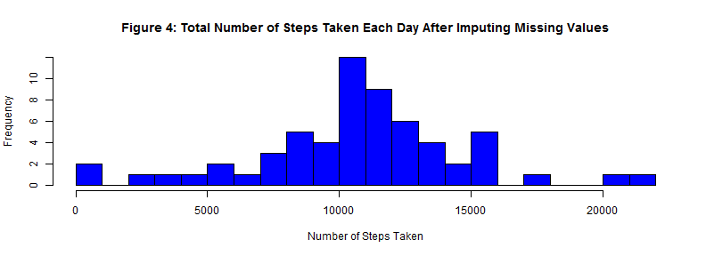

# Reproducible Research: Peer Assessment 1
### *Taking a Walk with Data - Jay Gendron*

## Loading and preprocessing the data

The purpose of this analysis is to answer a series of questions relating to the activity patterns of subjects wearing a personal activity monitoring device. The [data][1] (Peng, 2014a) for this analysis was provided to us on the Reproducible Research [GitHub repository][2] for the Coursera Data Science Specialization Program. The data used in this analysis is described in the source: 

>This device collects data at 5 minute intervals through out the day. The data consists of two months of data from an anonymous individual collected during the months of October and November, 2012 and include the number of steps taken in 5 minute intervals each day. (Reproducible Research | Coursera, 2014, para. 3)  

Because the data was placed in the GitHub repository, loading the data is a simple matter of unzipping the file and reading in the .csv file into a dataframe using the *read.csv* command.


```r
# Unzip the data and then read into dataframe
unzip("./RepData_PeerAssessment1/activity.zip")
DF <- read.csv("activity.csv")
# Present the underlying structure of dataframe DF
str(DF)
```

```
## 'data.frame':	17568 obs. of  3 variables:
##  $ steps   : int  NA NA NA NA NA NA NA NA NA NA ...
##  $ date    : Factor w/ 61 levels "2012-10-01","2012-10-02",..: 1 1 1 1 1 1 1 1 1 1 ...
##  $ interval: int  0 5 10 15 20 25 30 35 40 45 ...
```


Based on a review of the analytic needs of the project, an additional dataframe {dataComplete} was generated to isolate only "complete cases" having no missing values. This was accomplished by transforming the original dataframe {DF} using the *complete.cases()* command to remove all rows having an "NA" value. No other transformations were necessary on the original dataframe. Specifically, the structure of DF (and dataComplete) are appropriate for this analysis [steps=>int; data=>factor; interval=>int].


```r
# Eliminate all rows having value 'NA'
complete <- complete.cases(DF)
# Generate dataframe with only complete data
dataComplete <- DF[complete, ]
```


A summary view of the original and transformed dataframes shows that the 2,304 missing values (observations) were removed with no other impacts on the data.


```r
summary(DF)
```

```
##      steps               date          interval   
##  Min.   :  0.0   2012-10-01:  288   Min.   :   0  
##  1st Qu.:  0.0   2012-10-02:  288   1st Qu.: 589  
##  Median :  0.0   2012-10-03:  288   Median :1178  
##  Mean   : 37.4   2012-10-04:  288   Mean   :1178  
##  3rd Qu.: 12.0   2012-10-05:  288   3rd Qu.:1766  
##  Max.   :806.0   2012-10-06:  288   Max.   :2355  
##  NA's   :2304    (Other)   :15840
```

```r
summary(dataComplete)
```

```
##      steps               date          interval   
##  Min.   :  0.0   2012-10-02:  288   Min.   :   0  
##  1st Qu.:  0.0   2012-10-03:  288   1st Qu.: 589  
##  Median :  0.0   2012-10-04:  288   Median :1178  
##  Mean   : 37.4   2012-10-05:  288   Mean   :1178  
##  3rd Qu.: 12.0   2012-10-06:  288   3rd Qu.:1766  
##  Max.   :806.0   2012-10-07:  288   Max.   :2355  
##                  (Other)   :13536
```


The transformed dataframe was reduced from 17,568 observations to 15,264 observations


```r
str(dataComplete)
```

```
## 'data.frame':	15264 obs. of  3 variables:
##  $ steps   : int  0 0 0 0 0 0 0 0 0 0 ...
##  $ date    : Factor w/ 61 levels "2012-10-01","2012-10-02",..: 2 2 2 2 2 2 2 2 2 2 ...
##  $ interval: int  0 5 10 15 20 25 30 35 40 45 ...
```

## What is mean total number of steps taken per day?

Per instructions in the assignment, the missing values in the dataset were ignored to address this question - using dataframe {dataComplete}. Three calculations were required to fully answer the questions posed

- **sum** of total number of steps taken each day
- **mean** of total number of steps taken each day
- **median** of total number of steps taken each day

The *aggregate()* function was used to summarize the variable steps by date according to the three R functions *sum()*, *mean()*, and *median()*.


```r
# Calculate the total number of steps taken each day
sum <- aggregate(dataComplete$steps, by = list(dataComplete$date), sum)
# Calculate the mean and median total number of steps taken per day
means <- aggregate(dataComplete$steps, by = list(dataComplete$date), mean)
medians <- aggregate(dataComplete$steps, by = list(dataComplete$date), median)
# Report and visualize steps per day
summary(sum)
```

```
##        Group.1         x        
##  2012-10-02: 1   Min.   :   41  
##  2012-10-03: 1   1st Qu.: 8841  
##  2012-10-04: 1   Median :10765  
##  2012-10-05: 1   Mean   :10766  
##  2012-10-06: 1   3rd Qu.:13294  
##  2012-10-07: 1   Max.   :21194  
##  (Other)   :47
```

```r
hist(sum$x, breaks = 20, main = "Figure 1: Total Number of Steps Taken Each Day", 
    xlab = "Number of Steps Taken", col = "blue")
```

 


Figure 1 displays a histogram of the total number of steps taken each day. It is somewhat normally distributed - validated by the summary data showing that mean (10,766) is nearly equal to median (10,765) which is an indicator of a symmetric distribution. This histogram does display **a slight left skew** that will be important to note and recall later in the analysis during the imputing of missing data.

The other two values calculated during this section are listed here and displayed using a summary call in R.

#### Statistics on total number of steps taken each day 
- Mean number of steps taken each day = 37.3826
- Median number of steps taken each day = 0


```r
# Report calculations of the mean and median total number steps per day
summary(means)
```

```
##        Group.1         x        
##  2012-10-02: 1   Min.   : 0.14  
##  2012-10-03: 1   1st Qu.:30.70  
##  2012-10-04: 1   Median :37.38  
##  2012-10-05: 1   Mean   :37.38  
##  2012-10-06: 1   3rd Qu.:46.16  
##  2012-10-07: 1   Max.   :73.59  
##  (Other)   :47
```

```r
summary(medians)
```

```
##        Group.1         x    
##  2012-10-02: 1   Min.   :0  
##  2012-10-03: 1   1st Qu.:0  
##  2012-10-04: 1   Median :0  
##  2012-10-05: 1   Mean   :0  
##  2012-10-06: 1   3rd Qu.:0  
##  2012-10-07: 1   Max.   :0  
##  (Other)   :47
```


## What is the average daily activity pattern?

Similar to the descriptive statistics grouped by date, this R code calculates the mean and median number of steps taken each 5-minute interval. 


```r
# Descriptive statistics of mean and median based on interval
intervalMeans <- aggregate(dataComplete$steps, by = list(dataComplete$interval), 
    mean)
intervalMedians <- aggregate(dataComplete$steps, by = list(dataComplete$interval), 
    median)
# Calculating which 5-minute interval, on average across all the days in the
# dataset, contains the maximum number of steps
highest <- which(intervalMeans$x == max(intervalMeans$x))
steps <- intervalMeans[highest, 2]
interval <- intervalMeans[highest, 1]
```


These calculations enable a visualization through the use of a time-series plot.


```r
# Generate time-series plot
plot(intervalMeans$x ~ intervalMeans$Group.1, type = "l", lwd = 2, col = "blue", 
    main = "Figure 2: Daily Activity Pattern - Average Steps Taken Across Days", 
    xlab = "5-Minute Interval Identifier", ylab = "Average Number of Steps")
# Add vertical line and lable at interval containing highest value
abline(v = interval)
text(interval, max(intervalMeans$x) - 25, pos = 4, paste("Most active interval: ", 
    interval), col = "darkgreen")
```

 


Figure 2 provides a time series plot of the average number of steps taken (averaged across all days) as a function of the 5-minute intervals from 12:00 a.m. to 11:55 p.m. It is annotated to show the 5-minute interval that, on average, contains the maximum number of steps **(206.1698)** is interval **835**.

## Imputing missing values

The purpose of this section of the exploratory data analysis is to investigate the impact of imputing data within a dataset having many missing values. 


```r
# Calculate missing data (i.e., 'NA') from original data
missing <- is.na(DF)
table(missing)
```

```
## missing
## FALSE  TRUE 
## 50400  2304
```


Recall from the summary of the original dataframe {DF} that 2,304 rows contained missing data. They were removed in order to conduct the analysis that resulted in Figures 1 and 2 and the associated statistics. They were removed to allow exploration while reducing bias in the calculations or summaries of the daily activity patterns.

There are techniques to fill missing values by generating data using a process called imputation. This process requires a strategy. The assignment asked us to developed a relatively simplistic approach to imputation. Based on the work we have thus far, consider the implications of using the means (and/or medians) based on days (and/or intervals) already calculated.


```r
# Graphically display desciptive statistics calculated earlier
boxplot(means$x, medians$x, intervalMeans$x, intervalMedians$x, axes = FALSE, 
    main = "Figure 3: Consideration of Data for Imputation Strategy", xlab = "Measures of center and spread using two perspectives", 
    ylab = "Average Steps")
axis(1, 1:4, c("Mean by day", "Median by day", "Mean by interval", "Median by interval"))
axis(2)
box()
```

 


### *Strategy Considerations*
Based on the boxplot in Figure 3, two very different pictures emerge which require some though in determining an imputation strategy. Both medians (by day and by interval) are very close to zero. This indicates a highly right-skewed distribution of average steps per day. In these cases, a more robust measure of center is median; however, simply adding a value of "0" for each step observation of "NA" would not enhance the data - it would yield the same results as the original dataframe {DF}. 

Looking at the mean values by day and interval show equal point estimates (37.383 steps) but greatly different variances. If one were to use the mean point estimates, it may be best to use the mean by interval to better account for the variation and not simply add a fairly constant mean to the missing values. Figure 2 supports this logic because the average number of steps was near zero in the early morning and late evening hours.

### *An R Package that Helps Impute*
Kabacoff (2011) notes, "In simple imputation, the missing values in a variable are replaced with a single value (for example, mean, median, or mode)...An advantage to simple imputation is that it solves the 'missing values problem' without reducing the sample size" (p. 371). 

However, the author forewarns readers by noting, "...simple imputation is likely to underestimate standard errors, distort correlations among variables, and produce incorrect p-values in statistical tests. Like pairwise deletion, I recommend avoiding this approach for most missing data problems" (p. 371).

As noted by Dr. Peng (2014b) in his [YouTube video][3], "There's an R package for that." This led to research for an R package that enables imputation and retains rigor and quality in the data so as to *blend* the imputed dataset with a combination of values that are representative of the data collected. A package called **mice** was found. The creator (van Buuren, 2014) provides a package that fits a set of values by predicting values for missing data based on the data that does exist. This R code invokes the **mice** package and creates a new dataframe that is equal to the  original but with the missing data filled in.


```r
# Install package if not available to R and then open library
if (!"mice" %in% installed.packages()) {
    install.packages("mice")
}
library(mice)
```

```
## Loading required package: Rcpp
## mice 2.21 2014-02-05
```

```r
# Set parameters of the imputation alogorithm
impute <- mice(DF, seed = 330, m = 2)  # runs steps per iteration
```

```
## 
##  iter imp variable
##   1   1  steps
##   1   2  steps
##   2   1  steps
##   2   2  steps
##   3   1  steps
##   3   2  steps
##   4   1  steps
##   4   2  steps
##   5   1  steps
##   5   2  steps
```

```r
# Fit imputed data based on existing data
fit <- with(impute, lm(steps ~ date + interval))  #runs 5 iterations 
pooled <- pool(fit)
# summary(pooled) #available but not run here. See CRAN documentation
```


The result of the predictions is contained in the values *impute* and invoked using the command *complete()*. This will generate exactly the correct number of missing values in the correct locations and replace them. The result is a dataframe {finaldata}.


```r
# Merges original data (DF) with imputed date
finaldata <- complete(impute, 1)
# Indication of how many data values were imputed
dim(impute$imp$steps)
```

```
## [1] 2304    2
```


A quick summary look at this imputed data shows no missing data:


```r
summary(finaldata)  #Imputed data
```

```
##      steps               date          interval   
##  Min.   :  0.0   2012-10-01:  288   Min.   :   0  
##  1st Qu.:  0.0   2012-10-02:  288   1st Qu.: 589  
##  Median :  0.0   2012-10-03:  288   Median :1178  
##  Mean   : 37.1   2012-10-04:  288   Mean   :1178  
##  3rd Qu.: 10.0   2012-10-05:  288   3rd Qu.:1766  
##  Max.   :806.0   2012-10-06:  288   Max.   :2355  
##                  (Other)   :15840
```


Compare the imputed data to the original in dataframe {DF}.


```r
summary(DF)  #Original data
```

```
##      steps               date          interval   
##  Min.   :  0.0   2012-10-01:  288   Min.   :   0  
##  1st Qu.:  0.0   2012-10-02:  288   1st Qu.: 589  
##  Median :  0.0   2012-10-03:  288   Median :1178  
##  Mean   : 37.4   2012-10-04:  288   Mean   :1178  
##  3rd Qu.: 12.0   2012-10-05:  288   3rd Qu.:1766  
##  Max.   :806.0   2012-10-06:  288   Max.   :2355  
##  NA's   :2304    (Other)   :15840
```


The assignment posed the question, **Do these values differ from the estimates from the first part of the assignment?**

In a phrase - not really. As compared with a summary of the original data, the adjusted Mean   : 37.1   differs only slightly from the original Mean   : 37.4  . 

Likewise the summary of the sum of the number of steps taken each day (imputed versus original) is very similar in values and distribution - showing some difference in the shape as determined by the quantiles compared to the mean.


```r
sumFull <- aggregate(finaldata$steps, by = list(finaldata$date), sum)
summary(sumFull)  #Imputed data
```

```
##        Group.1         x        
##  2012-10-01: 1   Min.   :   41  
##  2012-10-02: 1   1st Qu.: 8918  
##  2012-10-03: 1   Median :10600  
##  2012-10-04: 1   Mean   :10687  
##  2012-10-05: 1   3rd Qu.:12811  
##  2012-10-06: 1   Max.   :21194  
##  (Other)   :55
```

```r
summary(sum)  #Original data
```

```
##        Group.1         x        
##  2012-10-02: 1   Min.   :   41  
##  2012-10-03: 1   1st Qu.: 8841  
##  2012-10-04: 1   Median :10765  
##  2012-10-05: 1   Mean   :10766  
##  2012-10-06: 1   3rd Qu.:13294  
##  2012-10-07: 1   Max.   :21194  
##  (Other)   :47
```


The influence of these statistics can be seen in the histogram provided in Figure 4. 


```r
hist(sumFull$x, breaks = 20, main = "Figure 4: Total Number of Steps Taken Each Day After Imputing Missing Values", 
    xlab = "Number of Steps Taken", col = "blue")
```

 


The other two values calculated during this section are listed here. The new mean differs slightly from the original and there was no change in the median values.


```r
# Calculate the mean and median total number of steps taken per day
meansFull <- aggregate(finaldata$steps, by = list(finaldata$date), mean)
mediansFull <- aggregate(finaldata$steps, by = list(finaldata$date), median)
```


#### Statistics on total number of steps taken each day - after imputation
- Imputed mean number of steps taken each day = 37.1073
- Imputed median number of steps taken each day = 0

- {Original mean number of steps taken each day = 37.3826}
- {Original median number of steps taken each day = 0}

The assignment also posed the question, **What is the impact of imputing missing data on the estimates of the total daily number of steps?**

Overall the impact of imputing missing data on the estimates was primarily in the variance (spread) and less so in the mean (center). The imputed dataset displays slightly less left skewness than the original but retains a similar mean. This is expected given the original data set was missing a lot of values in the left side of the distribution, filling those in will pull mean and median to the left - as well as the interquartile range.

## Are there differences in activity patterns between weekdays and weekends?

The first step in addressing this question is to create a new factor variable in the imputed dataset with two levels – “weekday” and “weekend” to show whether the observation occurs on a weekday or weekend day. The *weekdays()* function in R is helpful in interpreting dates.


```r
# Set date to class Date using imputed dataset with filled in missing values
finaldata.dates <- as.Date(finaldata[, 2])
# Create vector indicating day of week for each observation
weekdays <- weekdays(finaldata.dates)
# Add new variable to imputed dataseet
finaldata <- cbind(finaldata, weekdays)
# Simplify day of week to one of two factors
finaldata$weekdays <- gsub("Sunday", "weekend", finaldata$weekdays)
finaldata$weekdays <- gsub("Saturday", "weekend", finaldata$weekdays)
finaldata$weekdays <- gsub(".*day?", "weekday", finaldata$weekdays)
```


Having added the new variable, we can use the *tapply()* function to apply the *mean()* function to the dataset - taking the mean of steps taken, averaged across all weekday days or weekend days by interval.


```r
intervalMeansFull <- tapply(finaldata$steps, INDEX = list(finaldata$interval, 
    finaldata$weekdays), mean, na.rm = TRUE)
head(intervalMeansFull)
```

```
##    weekday weekend
## 0   3.4444   8.000
## 5   3.5111   2.000
## 10  3.7556   4.500
## 15  0.5778   1.125
## 20  0.2444   0.000
## 25 12.0444  16.062
```

```r
# Use reshape2 package to melt data
library(reshape2)
md <- melt(intervalMeansFull)
names(md)
```

```
## [1] "Var1"  "Var2"  "value"
```


Figure 5 provides a panel plot comparing activity patterns. The plot was created using the *xyplot()* function from the *lattice* package. It shows comparative time series plots of the average number of steps taken as a function of the 5-interval. It adds an additional dimension by comparing weekend days to weekday days. The plot indicates that the subjects were more active for longer periods of time during the weekend as the weekday. This would makes sense as during the weekday those in an office will produce less activity if they are sitting than during the weekend when they may be doing any number of things. One also notices the weekday has greater variation in activity amplitude where the weekend is overall a flatter distribution.


```r
library(lattice)
xyplot(value ~ Var1 | Var2, data = md, type = "l", layout = c(1, 2), main = "Figure 5: Comparison of Average Number of Steps Taken Across Weekends and Weekdays", 
    ylab = "Average number of steps", xlab = "5-Minute Interval Identifier")
```

 


### References

Kabacoff, R. I. (2011). *R in action:Data analysis and graphics with R*. Shelter Island, NY: Manning Publications Co.

Peng, R. D. (2014a, February 11). Activity monitoring data [Data file]. Retrieved from http://github.com/rdpeng/RepData_PeerAssessment1.

Peng, R. D. (Producer). (2014b, Feb 19). *There's An R package for that*. Retrieved from http://www.youtube.com/watch?v=yhTerzNFLbo.

Reproducible Research | Coursera. (2014). *Peer Assessment 1*. Retrieved from https://class.coursera.org/repdata-002/human_grading/view/courses/972084/assessments/3/submissions.

van Buuren, S., Groothuis-Oudshoorn, K., Robitzsch, A., Vink, G., Doove, L., & Jolani, S. (2014, February 5). *Multivariate imputation by chained equations*. Retrieved from http://cran.r-project.org/web/packages/mice/mice.pdf.

<!-- Hidden URL List -->
[1]: https://d396qusza40orc.cloudfront.net/repdata%2Fdata%2Factivity.zip
[2]: http://github.com/rdpeng/RepData_PeerAssessment1
[3]: http://www.youtube.com/watch?v=yhTerzNFLbo
