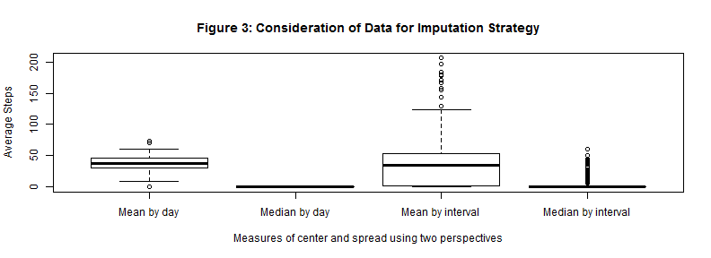

# Reproducible Research: Peer Assessment 1
### *Walking with the Data - Jay Gendron*

## Loading and preprocessing the data

The purpose of this analysis is to answer a series of questions relating to the activity patterns  from data collected from a personal activity monitoring device. The [data][1] for this analysis was provided to us on the Reproducible Research [GitHub Repository][2] for the Coursera Data Science Specialization Program. The data used in this analysis is summarized on {coursera } as 

>This device collects data at 5 minute intervals through out the day. The data consists of two months of data from an anonymous individual collected during the months of October and November, 2012 and include the number of steps taken in 5 minute intervals each day.  

Because it was loaded in the repository, loading the data is a simple matter of unzipping the file and reading in the .csv file into a dataframe.


```r
unzip("./RepData_PeerAssessment1/activity.zip")
DF <- read.csv("activity.csv")  #, colClasses=c(NA,'factor','factor'))
str(DF)
```

```
## 'data.frame':	17568 obs. of  3 variables:
##  $ steps   : int  NA NA NA NA NA NA NA NA NA NA ...
##  $ date    : Factor w/ 61 levels "2012-10-01","2012-10-02",..: 1 1 1 1 1 1 1 1 1 1 ...
##  $ interval: int  0 5 10 15 20 25 30 35 40 45 ...
```

Note the use of the ColClasses parameter to read the second two variables into the dataframe as factors

Based on a review of the analytic needs, the data was placed into three different datasets to address the questions:

* a subset containing only "complete cases" of the dataframe
* alkjadsf
* alskdfj


```r
complete <- complete.cases(DF)
data.complete <- DF[complete, ]
summary(data.complete)
```

```
##      steps               date          interval   
##  Min.   :  0.0   2012-10-02:  288   Min.   :   0  
##  1st Qu.:  0.0   2012-10-03:  288   1st Qu.: 589  
##  Median :  0.0   2012-10-04:  288   Median :1178  
##  Mean   : 37.4   2012-10-05:  288   Mean   :1178  
##  3rd Qu.: 12.0   2012-10-06:  288   3rd Qu.:1766  
##  Max.   :806.0   2012-10-07:  288   Max.   :2355  
##                  (Other)   :13536
```


convert date to 
2. Process/transform the data (if necessary) into a format suitable for your analysis

Let's take a quick look at the contents of this dataframe in a summary view


```r
summary(DF)
```

```
##      steps               date          interval   
##  Min.   :  0.0   2012-10-01:  288   Min.   :   0  
##  1st Qu.:  0.0   2012-10-02:  288   1st Qu.: 589  
##  Median :  0.0   2012-10-03:  288   Median :1178  
##  Mean   : 37.4   2012-10-04:  288   Mean   :1178  
##  3rd Qu.: 12.0   2012-10-05:  288   3rd Qu.:1766  
##  Max.   :806.0   2012-10-06:  288   Max.   :2355  
##  NA's   :2304    (Other)   :15840
```


## What is mean total number of steps taken per day?

The purpose of this analysis is to investigate the impact of imputing data within a dataset having many missing values.

For this part of the assignment, you can ignore the missing values in the dataset.
1. Make a histogram of the total number of steps taken each day
2. Calculate and report the mean and median total number of steps taken
per day


```r
sum <- tapply(data.complete$steps, data.complete$date, sum, na.rm = TRUE)
means <- tapply(data.complete$steps, data.complete$date, mean, na.rm = TRUE)
medians <- tapply(data.complete$steps, data.complete$date, median, na.rm = TRUE)
summary(sum)
```

```
##    Min. 1st Qu.  Median    Mean 3rd Qu.    Max.    NA's 
##      41    8840   10800   10800   13300   21200       8
```

```r
summary(means)
```

```
##    Min. 1st Qu.  Median    Mean 3rd Qu.    Max.    NA's 
##    0.14   30.70   37.40   37.40   46.20   73.60       8
```

```r
summary(medians)
```

```
##    Min. 1st Qu.  Median    Mean 3rd Qu.    Max.    NA's 
##       0       0       0       0       0       0       8
```

```r
hist(sum, breaks = 20)
```

 


## What is the average daily activity pattern?

1. Make a time series plot (i.e. type = "l") of the 5-minute interval (x-axis) and the average number of steps taken, averaged across all days (y-axis)
2. Which 5-minute interval, on average across all the days in the dataset, contains the maximum number of steps?


```r
interval.means <- tapply(data.complete$steps, data.complete$interval, mean, 
    na.rm = TRUE)
interval.medians <- tapply(data.complete$steps, data.complete$date, median, 
    na.rm = TRUE)
highest <- which(interval.means == max(interval.means))
steps <- interval.means[highest]
interval <- names(steps)
plot(interval.means ~ names(interval.means), type = "l", lwd = 2, col = "blue", 
    main = "Figure 2: Daily Activity Pattern - Average Steps Taken Across Days", 
    xlab = "5-Minute Interval Identifier", ylab = "Average Number of Steps")
abline(v = interval)
text(interval, max(interval.means) - 25, pos = 4, paste("Most active interval: ", 
    interval), col = "darkgreen")
```

 


the highest is 206.1698 which occurs in interval 835 (equivalent to 35

## Imputing missing values

Note that there are a number of days/intervals where there are missing values (coded as NA). The presence of missing days may introduce bias into some calculations or summaries of the data.
1. Calculate and report the total number of missing values in the dataset (i.e. the total number of rows with NAs)

This table call provides an indication of the magnitude of misssing values in the full dataset:


```r
missing <- is.na(DF)
table(missing)
```

```
## missing
## FALSE  TRUE 
## 50400  2304
```


As noted in the assignment instructions, a dataset containing a large number of missing values could introduce bias into the results for daily activity patterns. These missing value can be filled with generated data using a process called imputation. This process requires a strategy. The assignment asked us to developed a relatively simplistic approach to imputation. Based on the work we have thusfar, let's consider how representative the various means and medians for days and intervals from values already calculated.

2. Devise a strategy for filling in all of the missing values in the dataset. The strategy does not need to be sophisticated. For example, you could use the mean/median for that day, or the mean for that 5-minute interval, etc.A


```r
boxplot(means, medians, interval.means, interval.medians, axes = FALSE, main = "Figure 3: Consideration of data distribution for imputation  strategy", 
    xlab = "Measures of center and spread by two perspectives", ylab = "Average Steps")
axis(1, 1:4, c("Mean by day", "Median by day", "Mean by interval", "Median by interval"))
axis(2)
box()
```

 


Based on this quick boxplot, one may dismiss a strategy using the data factored by interval as compared by day based on the higher variance present. This makes sense in light of the time series plot of daily activity patterns in Figure 2 showing the variation seen with respect to time of day. That leaves manipulation by day. It is noteworthy to see a median of zero. This indicates a very right-skewed dataset. In these cases, a more robust measure of center is median; however, simply adding a value of "0" for each step observation of "NA" would not enhance the data - it would yield the same results.

This led to an inquiry on other methods of imputation that may *blend* the final dataset with a combination of "0"s and "NA"s that are representative of the data collected.

Kabucoff (2011) notes, "In simple imputation, the missing values in a variable are replaced with a single value (for example, mean, median, or mode)...An advantage to simple imputation is that it solves the 'missing values problem' without reducing the sample size" (p. 371).

However, the author forewarns readers by noting, "...simple imputation is likely to underestimate standard errors, distort correlations among variables, and produce incorrect p-values in statistical tests. Like pairwise deletion, I recommend avoiding this approach for most missing data problems" (p. 371).

3. Create a new dataset that is equal to the original dataset but with the missing data filled in.


```r
if (!"mice" %in% installed.packages()) {
    install.packages("mice")
}
library(mice)
```

```
## Loading required package: Rcpp
## mice 2.21 2014-02-05
```

```r
imp <- mice(DF, m = 2)  # runs steps per iteration
```

```
## 
##  iter imp variable
##   1   1  steps
##   1   2  steps
##   2   1  steps
##   2   2  steps
##   3   1  steps
##   3   2  steps
##   4   1  steps
##   4   2  steps
##   5   1  steps
##   5   2  steps
```

```r
fit <- with(imp, lm(steps ~ date + interval))  #runs 5 iterations 
pooled <- pool(fit)
# summary(pooled) #available but not run here. See CRAN documentation Merges
# original data (DF) with imputed date
finaldata <- complete(imp, 1)
dim(imp$imp$steps)
```

```
## [1] 2304    2
```


A quick summary look at this imputed data shows no missing data

```r
summary(finaldata)
```

```
##      steps               date          interval   
##  Min.   :  0.0   2012-10-01:  288   Min.   :   0  
##  1st Qu.:  0.0   2012-10-02:  288   1st Qu.: 589  
##  Median :  0.0   2012-10-03:  288   Median :1178  
##  Mean   : 38.8   2012-10-04:  288   Mean   :1178  
##  3rd Qu.: 15.0   2012-10-05:  288   3rd Qu.:1766  
##  Max.   :806.0   2012-10-06:  288   Max.   :2355  
##                  (Other)   :15840
```


Summary of original data

```r
summary(DF)
```

```
##      steps               date          interval   
##  Min.   :  0.0   2012-10-01:  288   Min.   :   0  
##  1st Qu.:  0.0   2012-10-02:  288   1st Qu.: 589  
##  Median :  0.0   2012-10-03:  288   Median :1178  
##  Mean   : 37.4   2012-10-04:  288   Mean   :1178  
##  3rd Qu.: 12.0   2012-10-05:  288   3rd Qu.:1766  
##  Max.   :806.0   2012-10-06:  288   Max.   :2355  
##  NA's   :2304    (Other)   :15840
```


As compared with a summary of the original data, the adjusted Mean   : 38.8   differs only slightly from the original Mean   : 37.4   


4. Make a histogram of the total number of steps taken each day and Calculate and report the mean and median total number of steps taken per day. 


```r
sum.full <- tapply(finaldata$steps, finaldata$date, sum, na.rm = TRUE)
means.full <- tapply(data.complete$steps, data.complete$date, mean, na.rm = TRUE)
medians.full <- tapply(data.complete$steps, data.complete$date, median, na.rm = TRUE)
summary(sum.full)
```

```
##    Min. 1st Qu.  Median    Mean 3rd Qu.    Max. 
##      41    9820   11500   11200   13500   21200
```

```r
summary(means.full)
```

```
##    Min. 1st Qu.  Median    Mean 3rd Qu.    Max.    NA's 
##    0.14   30.70   37.40   37.40   46.20   73.60       8
```

```r
summary(medians.full)
```

```
##    Min. 1st Qu.  Median    Mean 3rd Qu.    Max.    NA's 
##       0       0       0       0       0       0       8
```

```r
hist(sum.full, breaks = 20)
```

 


The assignment posed the question, **Do these values differ from the estimates from the first part of the assignment?**

The assignment also posed the question, **What is the impact of imputing missing data on the estimates of the total daily number of steps?**

## Are there differences in activity patterns between weekdays and weekends?

For this part the weekdays() function may be of some help here. Use the dataset with the filled-in missing values for this part.


```r
finaldata.dates <- as.Date(finaldata[, 2])
weekdays <- weekdays(finaldata.dates)
finaldata <- cbind(finaldata, weekdays)
finaldata$weekdays <- gsub("Sunday", "weekend", finaldata$weekdays)
finaldata$weekdays <- gsub("Saturday", "weekend", finaldata$weekdays)
finaldata$weekdays <- gsub(".*day?", "weekday", finaldata$weekdays)
```


1. Create a new factor variable in the dataset with two levels – “weekday” and “weekend” indicating whether a given date is a weekday or weekend day.
2. Make a panel plot containing a time series plot (i.e. type = "l") of the 5-minute interval (x-axis) and the average number of steps taken, averaged across all weekday days or weekend days (y-axis). 


```r
library(lattice)
## Simple scatterplot
interval.means.full <- tapply(finaldata$steps, INDEX = list(finaldata$interval, 
    finaldata$weekdays), mean, na.rm = TRUE)
head(interval.means.full)
```

```
##    weekday weekend
## 0  3.62222    0.00
## 5  4.66667    9.25
## 10 0.55556    0.00
## 15 0.17778    0.00
## 20 0.08889    0.00
## 25 1.31111    3.25
```


#xyplot(Ozone ~ Wind | weekdays, data = finaldata, layout = c(1,2))


```r
library(reshape2)
md <- melt(interval.means.full)
names(md)
```

```
## [1] "Var1"  "Var2"  "value"
```


Now we can easily plot it with the `xyplot()` function to compare the activity patterns:


```r
library(lattice)
xyplot(value ~ Var1 | Var2, data = md, type = "l", layout = c(1, 2), xlab = "Interval", 
    ylab = "Average number of steps", main = "blah blah blah")
```

 


```
<!-- URL List -->
[1]: https://d396qusza40orc.cloudfront.net/repdata%2Fdata%2Factivity.zip
[2]: http://github.com/rdpeng/RepData_PeerAssessment1


van Buuren, S., Groothuis-Oudshoorn, K., Robitzsch, A., Vink, G., Doove, L., & Jolani, S. (2014, February 5). *Multivariate imputation by chained equations*. Retrieved from http://cran.r-project.org/web/packages/mice/mice.pdf.


URL http://www.stefvanbuuren.nl , http://www.multiple-imputation.com


